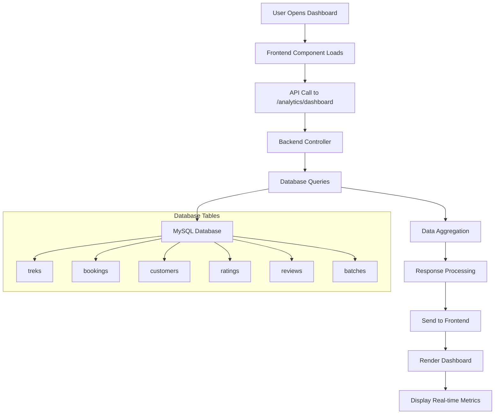
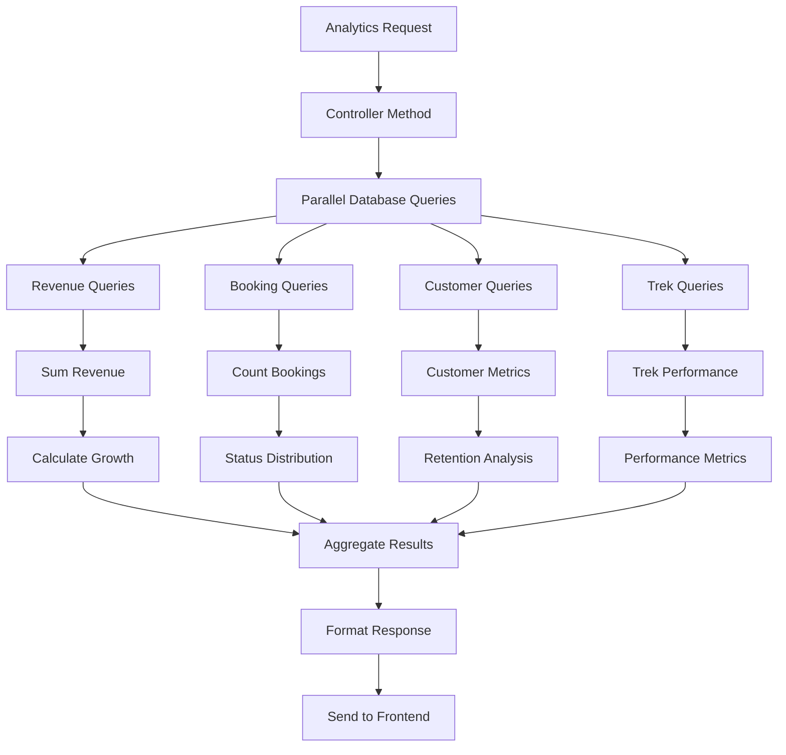
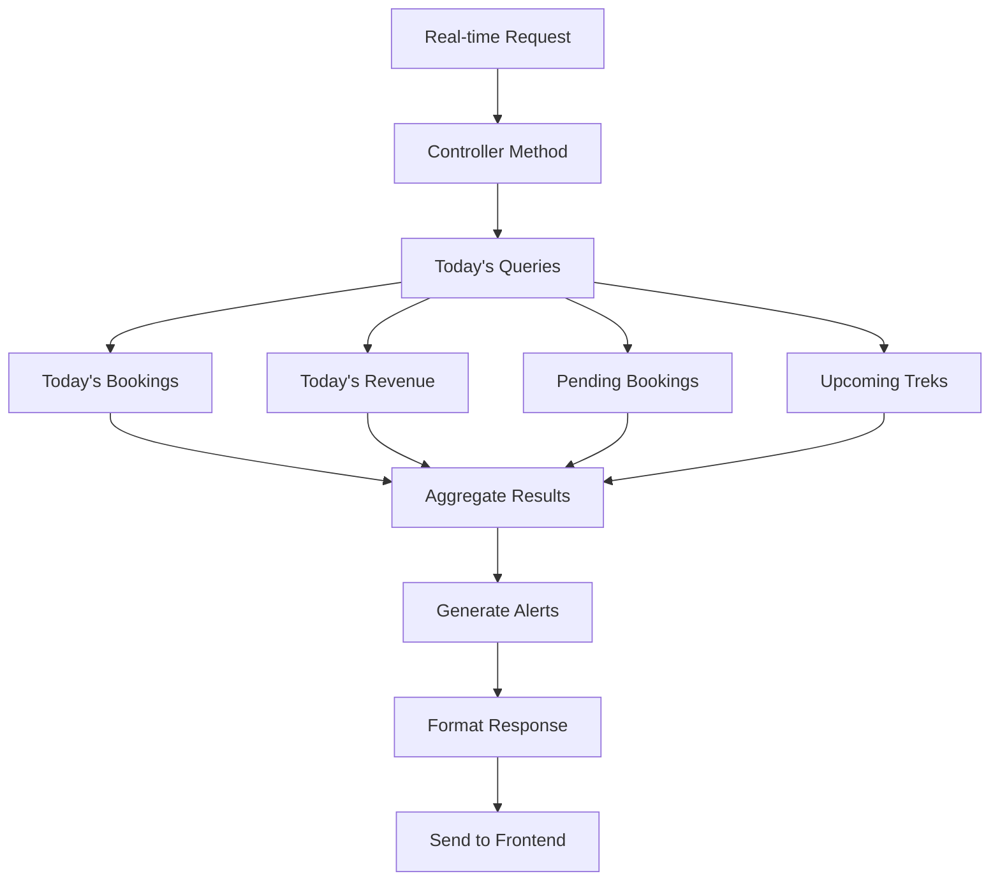
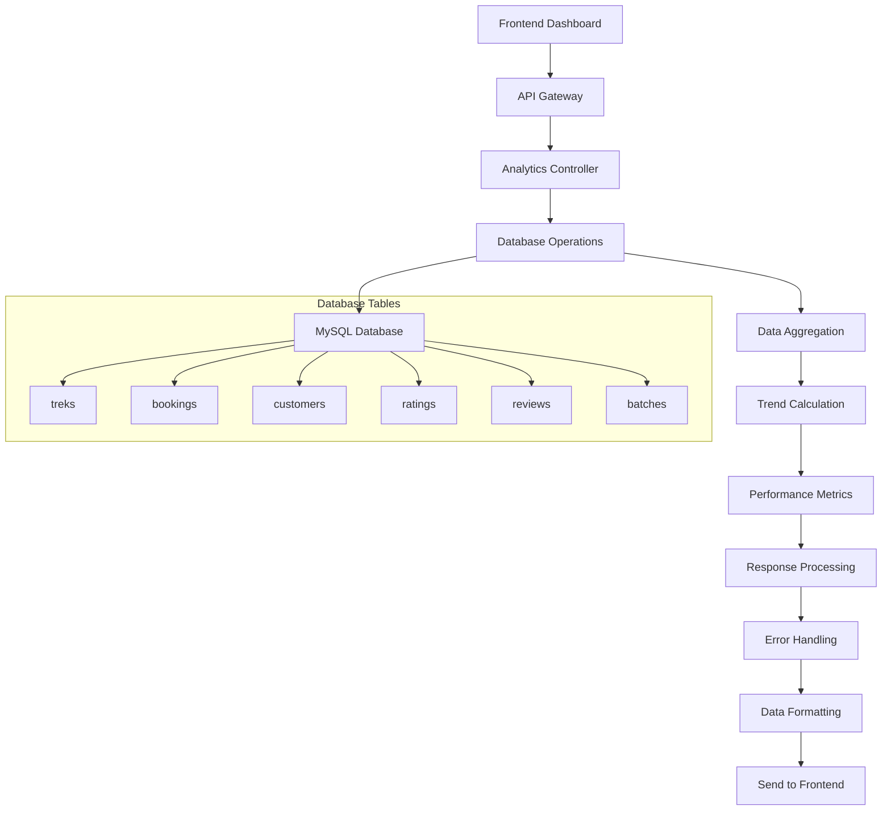

# Analytics & Dashboard Module

## Overview

The Analytics & Dashboard module provides real-time business intelligence and performance metrics for vendors. It dynamically fetches data from the database and presents comprehensive analytics including revenue tracking, booking patterns, customer insights, and trek performance.

## Components

### Frontend Components

- `Dashboard.jsx` - Main vendor dashboard with real-time data (743 lines)
- `Analytics.jsx` - Detailed analytics interface with charts
- Real-time metrics cards and performance indicators

### Backend Components

- `analyticsController.js` - Analytics business logic with database integration (1168 lines)
- `analyticsRoutes.js` - Analytics API routes
- Database queries for real-time data aggregation

## Batch-Based Trek Display

The system treats each batch of a trek as a separate trek entry when displaying upcoming treks. This approach provides better granularity and allows vendors to track individual batch performance.

### Batch Trek Structure

Each batch-trek entry includes:

- **Unique ID**: `trek_id_batch_id` format
- **Title**: `Trek Name - Batch TBR_ID` format
- **Start/End Dates**: From batch data
- **Slots**: Booked vs total capacity from batch
- **Trek Details**: Duration, difficulty, type, price from parent trek

## Field Mapping

### Dashboard Overview Fields

| Frontend Field   | Backend API Field    | Database Column           | Type    | Required |
| ---------------- | -------------------- | ------------------------- | ------- | -------- |
| `activeTreks`    | `active_treks_count` | `treks.status = 'active'` | Integer | Auto     |
| `totalBookings`  | `total_bookings`     | `bookings.id`             | Integer | Auto     |
| `monthlyRevenue` | `monthly_revenue`    | `bookings.total_amount`   | Decimal | Auto     |
| `averageRating`  | `average_rating`     | `ratings.rating_value`    | Decimal | Auto     |
| `totalReviews`   | `total_reviews`      | `reviews.id`              | Integer | Auto     |
| `upcomingTreks`  | `upcoming_treks`     | `batches.start_date`      | Array   | Auto     |
| `recentBookings` | `recent_bookings`    | `bookings.created_at`     | Array   | Auto     |

### Upcoming Trek Batches Fields

| Frontend Field    | Backend API Field | Database Column                | Type    | Required |
| ----------------- | ----------------- | ------------------------------ | ------- | -------- |
| `id`              | `id`              | `trek_id_batch_id`             | String  | Auto     |
| `trek_id`         | `trek_id`         | `treks.id`                     | Integer | Auto     |
| `batch_id`        | `batch_id`        | `batches.id`                   | Integer | Auto     |
| `title`           | `title`           | `treks.title + batches.tbr_id` | String  | Auto     |
| `start_date`      | `start_date`      | `batches.start_date`           | Date    | Auto     |
| `end_date`        | `end_date`        | `batches.end_date`             | Date    | Auto     |
| `booked_slots`    | `booked_slots`    | `batches.booked_slots`         | Integer | Auto     |
| `total_slots`     | `total_slots`     | `batches.capacity`             | Integer | Auto     |
| `available_slots` | `available_slots` | `batches.available_slots`      | Integer | Auto     |
| `trek_duration`   | `trek_duration`   | `treks.duration`               | String  | Auto     |
| `trek_difficulty` | `trek_difficulty` | `treks.difficulty`             | String  | Auto     |
| `trek_type`       | `trek_type`       | `treks.trek_type`              | String  | Auto     |
| `base_price`      | `base_price`      | `treks.base_price`             | Decimal | Auto     |

### Revenue Analytics Fields

| Frontend Field        | Backend API Field       | Database Column         | Type    | Required |
| --------------------- | ----------------------- | ----------------------- | ------- | -------- |
| `currentMonthRevenue` | `current_month_revenue` | `bookings.total_amount` | Decimal | Auto     |
| `lastMonthRevenue`    | `last_month_revenue`    | `bookings.total_amount` | Decimal | Auto     |
| `revenueGrowth`       | `revenue_growth`        | Calculated              | Decimal | Auto     |
| `totalRevenue`        | `total_revenue`         | `bookings.total_amount` | Decimal | Auto     |
| `averageBookingValue` | `average_booking_value` | Calculated              | Decimal | Auto     |
| `revenueByTrek`       | `revenue_by_trek`       | Grouped by trek_id      | Object  | Auto     |

### Booking Analytics Fields

| Frontend Field          | Backend API Field    | Database Column                 | Type    | Required |
| ----------------------- | -------------------- | ------------------------------- | ------- | -------- |
| `totalBookings`         | `total_bookings`     | `bookings.id`                   | Integer | Auto     |
| `confirmedBookings`     | `confirmed_bookings` | `bookings.status = 'confirmed'` | Integer | Auto     |
| `pendingBookings`       | `pending_bookings`   | `bookings.status = 'pending'`   | Integer | Auto     |
| `cancelledBookings`     | `cancelled_bookings` | `bookings.status = 'cancelled'` | Integer | Auto     |
| `bookingConversionRate` | `conversion_rate`    | Calculated                      | Decimal | Auto     |
| `bookingsByStatus`      | `bookings_by_status` | Grouped by status               | Object  | Auto     |
| `bookingsByMonth`       | `bookings_by_month`  | Grouped by month                | Array   | Auto     |

### Customer Analytics Fields

| Frontend Field          | Backend API Field       | Database Column        | Type    | Required |
| ----------------------- | ----------------------- | ---------------------- | ------- | -------- |
| `totalCustomers`        | `total_customers`       | `customers.id`         | Integer | Auto     |
| `newCustomers`          | `new_customers`         | `customers.created_at` | Integer | Auto     |
| `repeatCustomers`       | `repeat_customers`      | Calculated             | Integer | Auto     |
| `customerRetentionRate` | `retention_rate`        | Calculated             | Decimal | Auto     |
| `topCustomers`          | `top_customers`         | Grouped by customer_id | Array   | Auto     |
| `customerSatisfaction`  | `customer_satisfaction` | `ratings.rating_value` | Decimal | Auto     |

### Trek Performance Fields

| Frontend Field       | Backend API Field | Database Column         | Type    | Required |
| -------------------- | ----------------- | ----------------------- | ------- | -------- |
| `trekBookings`       | `trek_bookings`   | `bookings.trek_id`      | Integer | Auto     |
| `trekRevenue`        | `trek_revenue`    | `bookings.total_amount` | Decimal | Auto     |
| `trekRating`         | `trek_rating`     | `ratings.rating_value`  | Decimal | Auto     |
| `trekPopularity`     | `trek_popularity` | Calculated              | Integer | Auto     |
| `trekOccupancy`      | `trek_occupancy`  | Calculated              | Decimal | Auto     |
| `topPerformingTreks` | `top_treks`       | Grouped by trek_id      | Array   | Auto     |

### Date Range Filter Fields

| Frontend Field | Backend API Field | Database Column       | Type   | Required |
| -------------- | ----------------- | --------------------- | ------ | -------- |
| `startDate`    | `start_date`      | `bookings.created_at` | Date   | No       |
| `endDate`      | `end_date`        | `bookings.created_at` | Date   | No       |
| `dateRange`    | `date_range`      | N/A                   | String | No       |
| `period`       | `period`          | N/A                   | String | No       |

## API Endpoints

### 1. Get Dashboard Overview

- **URL**: `GET /api/vendor/analytics/dashboard`
- **Method**: GET
- **Authentication**: Required (JWT)
- **Purpose**: Get real-time dashboard overview with key metrics
- **Query Parameters**:
  - `start_date`: Start date for custom range
  - `end_date`: End date for custom range
- **Response**:

```json
{
  "success": true,
  "data": {
    "overview": {
      "active_treks": "integer",
      "total_bookings": "integer",
      "monthly_revenue": "decimal",
      "average_rating": "decimal",
      "total_reviews": "integer"
    },
    "trends": {
      "revenue_growth": "decimal",
      "booking_growth": "decimal",
      "rating_trend": "decimal"
    },
    "upcoming_treks": [
      {
        "id": "integer",
        "title": "string",
        "start_date": "date",
        "booked_slots": "integer",
        "total_slots": "integer"
      }
    ],
    "recent_bookings": [
      {
        "id": "integer",
        "booking_id": "string",
        "customer_name": "string",
        "trek_title": "string",
        "amount": "decimal",
        "status": "string",
        "created_at": "datetime"
      }
    ],
    "recent_reviews": [
      {
        "id": "integer",
        "customer_name": "string",
        "trek_title": "string",
        "rating": "integer",
        "comment": "string",
        "created_at": "datetime"
      }
    ]
  }
}
```

### 2. Get Revenue Analytics

- **URL**: `GET /api/vendor/analytics/revenue`
- **Method**: GET
- **Authentication**: Required (JWT)
- **Purpose**: Get detailed revenue analytics and trends
- **Query Parameters**:
  - `period`: Time period (week, month, quarter, year)
  - `group_by`: Group by (day, week, month, trek)
- **Response**:

```json
{
  "success": true,
  "data": {
    "summary": {
      "total_revenue": "decimal",
      "current_period_revenue": "decimal",
      "previous_period_revenue": "decimal",
      "growth_percentage": "decimal",
      "average_booking_value": "decimal"
    },
    "trends": [
      {
        "date": "date",
        "revenue": "decimal",
        "bookings": "integer"
      }
    ],
    "by_trek": [
      {
        "trek_id": "integer",
        "trek_title": "string",
        "revenue": "decimal",
        "bookings": "integer",
        "average_rating": "decimal"
      }
    ],
    "by_payment_method": [
      {
        "method": "string",
        "revenue": "decimal",
        "count": "integer"
      }
    ]
  }
}
```

### 3. Get Booking Analytics

- **URL**: `GET /api/vendor/analytics/bookings`
- **Method**: GET
- **Authentication**: Required (JWT)
- **Purpose**: Get booking performance analytics
- **Response**:

```json
{
  "success": true,
  "data": {
    "summary": {
      "total_bookings": "integer",
      "confirmed_bookings": "integer",
      "pending_bookings": "integer",
      "cancelled_bookings": "integer",
      "conversion_rate": "decimal"
    },
    "status_distribution": [
      {
        "status": "string",
        "count": "integer",
        "percentage": "decimal"
      }
    ],
    "trends": [
      {
        "date": "date",
        "bookings": "integer",
        "revenue": "decimal"
      }
    ],
    "by_trek": [
      {
        "trek_id": "integer",
        "trek_title": "string",
        "bookings": "integer",
        "revenue": "decimal",
        "occupancy_rate": "decimal"
      }
    ]
  }
}
```

### 4. Get Customer Analytics

- **URL**: `GET /api/vendor/analytics/customers`
- **Method**: GET
- **Authentication**: Required (JWT)
- **Purpose**: Get customer insights and behavior
- **Response**:

```json
{
  "success": true,
  "data": {
    "overview": {
      "total_customers": "integer",
      "active_customers": "integer",
      "new_customers": "integer",
      "repeat_customers": "integer",
      "retention_rate": "decimal",
      "average_customer_value": "decimal"
    },
    "trends": {
      "customer_growth": "decimal",
      "retention_rate": "decimal",
      "average_booking_frequency": "decimal"
    },
    "top_customers": [
      {
        "customer_id": "integer",
        "name": "string",
        "total_bookings": "integer",
        "total_spent": "decimal",
        "last_booking": "datetime"
      }
    ],
    "customer_satisfaction": {
      "average_rating": "decimal",
      "total_reviews": "integer",
      "rating_distribution": [
        {
          "rating": "integer",
          "count": "integer"
        }
      ]
    },
    "customer_trends": [
      {
        "date": "date",
        "new_customers": "integer",
        "repeat_customers": "integer"
      }
    ]
  }
}
```

### 5. Get Trek Performance Analytics

- **URL**: `GET /api/vendor/analytics/treks`
- **Method**: GET
- **Authentication**: Required (JWT)
- **Purpose**: Get trek performance metrics
- **Response**:

```json
{
  "success": true,
  "data": {
    "summary": {
      "total_treks": "integer",
      "active_treks": "integer",
      "average_rating": "decimal",
      "total_revenue": "decimal"
    },
    "top_performing_treks": [
      {
        "trek_id": "integer",
        "title": "string",
        "bookings": "integer",
        "revenue": "decimal",
        "rating": "decimal",
        "occupancy_rate": "decimal"
      }
    ],
    "trek_analytics": [
      {
        "trek_id": "integer",
        "title": "string",
        "total_bookings": "integer",
        "total_revenue": "decimal",
        "average_rating": "decimal",
        "review_count": "integer",
        "occupancy_rate": "decimal",
        "profit_margin": "decimal"
      }
    ]
  }
}
```

### 6. Get Real-time Metrics

- **URL**: `GET /api/vendor/analytics/realtime`
- **Method**: GET
- **Authentication**: Required (JWT)
- **Purpose**: Get real-time dashboard metrics
- **Response**:

```json
{
  "success": true,
  "data": {
    "today_bookings": "integer",
    "today_revenue": "decimal",
    "pending_bookings": "integer",
    "upcoming_treks": "integer",
    "alerts": [
      {
        "type": "string",
        "message": "string",
        "timestamp": "datetime"
      }
    ]
  }
}
```

## Visual Flow Diagrams

### Dashboard Data Flow



### Analytics Processing



### Real-time Analytics



### Data Flow Architecture



## Special Features

### Real-time Dashboard

- Live metrics updates with automatic refresh
- Real-time alerts and notifications
- Dynamic data visualization
- Performance monitoring

### Advanced Analytics

- Revenue trend analysis with growth calculations
- Booking pattern recognition
- Customer segmentation and behavior analysis
- Trek performance comparison

### Data Visualization

- Interactive charts and graphs
- Performance dashboards
- Trend analysis and forecasting
- Comparative analytics

### Export Capabilities

- PDF report generation
- Excel data export
- Custom date range reports
- Automated report scheduling

## Error Handling

### Common Error Scenarios

1. **Data Loading Errors**: Database connection issues
2. **Calculation Errors**: Invalid aggregation queries
3. **Performance Issues**: Large dataset processing
4. **Authentication Errors**: Invalid JWT tokens

### Error Response Format

```json
{
  "success": false,
  "message": "Failed to retrieve analytics data",
  "error": "Database connection timeout",
  "timestamp": "2024-01-15T10:30:00Z"
}
```

### Frontend Error Handling

- Loading states for all data fetching
- Error boundaries for component failures
- Retry mechanisms for failed requests
- User-friendly error messages

## Performance Optimizations

### Database Optimizations

- Indexed date range queries
- Efficient aggregation functions
- Query result caching
- Parallel database operations

### Frontend Optimizations

- Lazy loading of charts
- Debounced data updates
- Memoized calculations
- Efficient re-rendering

### Caching Strategy

- Redis cache for frequent queries
- Browser caching for static data
- API response caching
- Real-time data invalidation

## Security

### Data Access Control

- Vendor-specific data isolation
- Role-based analytics access
- Secure API endpoints
- Data privacy protection

### Data Privacy

- Anonymized customer data
- Secure data transmission
- Data retention policies
- GDPR compliance measures

## API Integration

### Frontend-Backend Contract

```javascript
// Dashboard data fetching
const fetchDashboardData = async () => {
  try {
    const response = await apiVendor.get("/analytics/dashboard");
    if (response.success) {
      setDashboardData(response.data);
    }
  } catch (error) {
    handleError(error);
  }
};

// Real-time updates
const startRealTimeUpdates = () => {
  const interval = setInterval(fetchDashboardData, 30000); // 30 seconds
  return () => clearInterval(interval);
};
```

### Error Handling Integration

```javascript
// Comprehensive error handling
const handleAnalyticsError = (error) => {
  console.error("Analytics error:", error);
  toast.error("Failed to load analytics data");
  setError(error.message);
};
```

## Database Schema Integration

### Key Tables

- `treks` - Trek information and performance
- `bookings` - Booking data and revenue
- `customers` - Customer profiles and behavior
- `ratings` - Customer satisfaction metrics
- `reviews` - Customer feedback data
- `batches` - Trek scheduling and capacity

### Query Optimization

```sql
-- Optimized revenue query
SELECT
  SUM(total_amount) as revenue,
  COUNT(*) as bookings,
  DATE(created_at) as date
FROM bookings
WHERE vendor_id = ?
  AND payment_status = 'completed'
  AND created_at >= ?
GROUP BY DATE(created_at)
ORDER BY date DESC;
```

## Future Enhancements

### Planned Features

- Machine learning for trend prediction
- Advanced customer segmentation
- Real-time notifications
- Mobile analytics app
- Custom report builder
- Integration with external analytics tools

### Scalability Improvements

- Microservices architecture
- Horizontal scaling
- Load balancing
- Database sharding
- CDN integration
