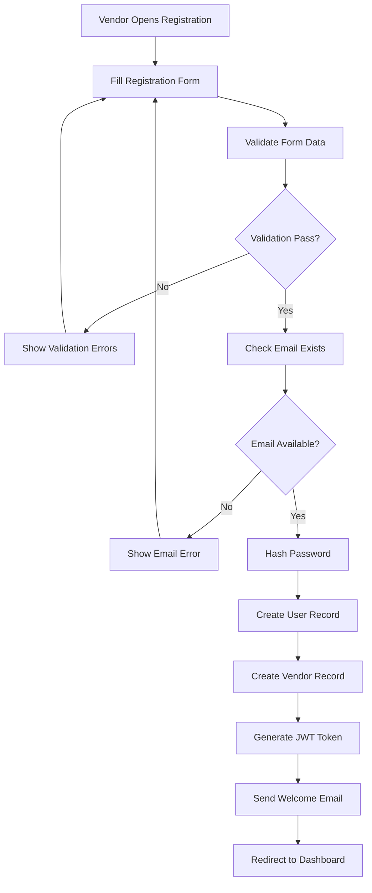
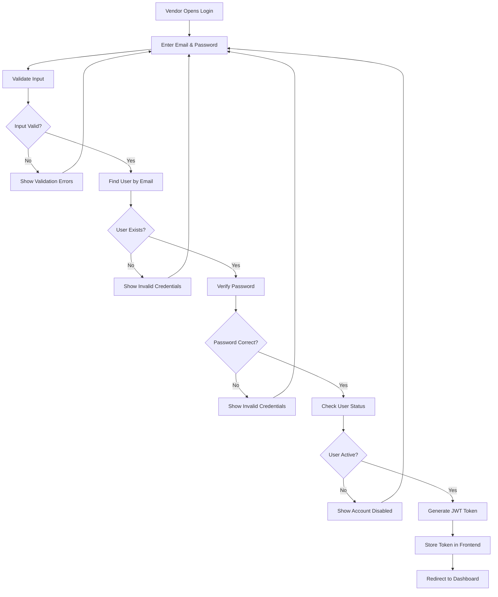
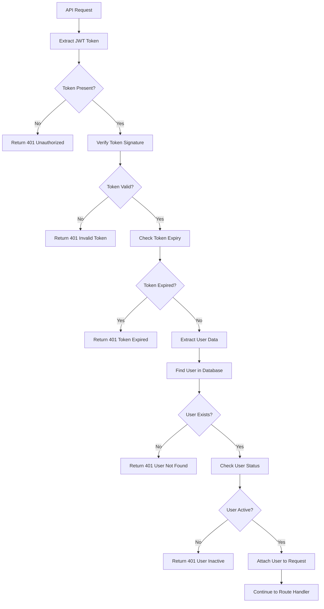
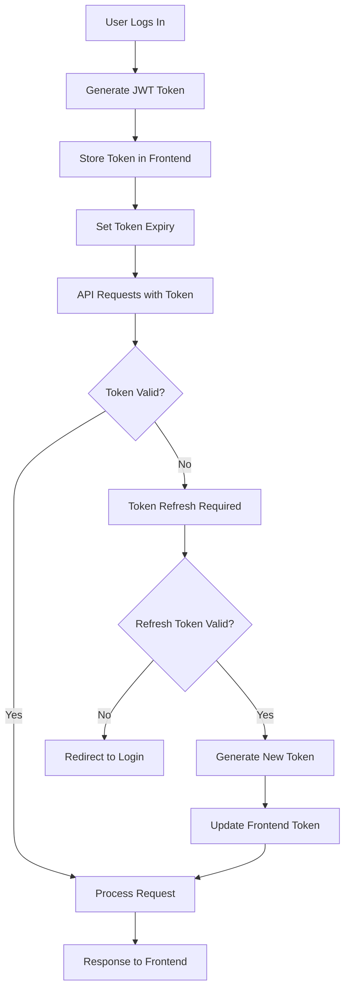
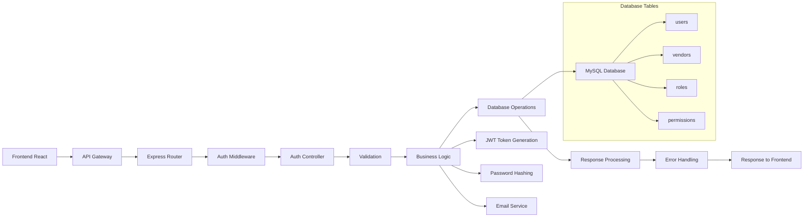

# Authentication Module

## Overview

The Authentication module handles user authentication and authorization for the vendor panel. It manages vendor registration, login, session management, and role-based access control. This module ensures secure access to vendor-specific functionality.

## Module Components

### Frontend Components

- `Login.jsx` - Vendor login form
- `Register.jsx` - Vendor registration form
- `VendorLogin.jsx` - Vendor-specific login interface
- `AuthRedirect.jsx` - Authentication redirect handling
- `Protected.jsx` - Route protection component

### Backend Components

- `authController.js` - Authentication business logic (179 lines)
- `authRoutes.js` - Authentication API routes
- `authMiddleware.js` - JWT token validation middleware
- `User.js` - User database model
- `Vendor.js` - Vendor database model

## Field Mapping

### Registration Fields

| Frontend Field    | Backend API Field | Database Column        | Type            | Required |
| ----------------- | ----------------- | ---------------------- | --------------- | -------- |
| `name`            | `name`            | `users.name`           | String          | Yes      |
| `email`           | `email`           | `users.email`          | String          | Yes      |
| `password`        | `password`        | `users.password_hash`  | String (hashed) | Yes      |
| `confirmPassword` | N/A               | N/A                    | String          | Yes      |
| `companyInfo`     | `company_info`    | `vendors.company_info` | JSON            | No       |
| `phone`           | `phone`           | `users.phone`          | String          | No       |
| `address`         | `address`         | `users.address`        | Text            | No       |

### Login Fields

| Frontend Field | Backend API Field | Database Column       | Type            | Required |
| -------------- | ----------------- | --------------------- | --------------- | -------- |
| `email`        | `email`           | `users.email`         | String          | Yes      |
| `password`     | `password`        | `users.password_hash` | String (hashed) | Yes      |
| `rememberMe`   | `remember_me`     | N/A                   | Boolean         | No       |

### User Profile Fields

| Frontend Field | Backend API Field | Database Column    | Type     | Required |
| -------------- | ----------------- | ------------------ | -------- | -------- |
| `userId`       | `id`              | `users.id`         | Integer  | Auto     |
| `vendorId`     | `id`              | `vendors.id`       | Integer  | Auto     |
| `roleId`       | `role_id`         | `users.role_id`    | Integer  | Yes      |
| `status`       | `status`          | `users.status`     | ENUM     | Yes      |
| `createdAt`    | `created_at`      | `users.created_at` | DateTime | Auto     |
| `updatedAt`    | `updated_at`      | `users.updated_at` | DateTime | Auto     |

### JWT Token Fields

| Frontend Field | Backend API Field | Database Column | Type     | Required |
| -------------- | ----------------- | --------------- | -------- | -------- |
| `token`        | `token`           | N/A             | String   | Yes      |
| `refreshToken` | `refresh_token`   | N/A             | String   | No       |
| `expiresAt`    | `expires_at`      | N/A             | DateTime | Yes      |
| `userId`       | `user_id`         | N/A             | Integer  | Yes      |
| `vendorId`     | `vendor_id`       | N/A             | Integer  | Yes      |
| `role`         | `role`            | N/A             | String   | Yes      |

## API Endpoints

### Authentication

#### 1. Vendor Registration

- **URL**: `POST /api/vendor/auth/register`
- **Method**: POST
- **Authentication**: Not required
- **Purpose**: Register a new vendor account
- **Request Payload**:

```json
{
  "name": "string",
  "email": "string",
  "password": "string",
  "company_info": {
    "company_name": "string",
    "gst_number": "string",
    "pan_number": "string",
    "address": "string",
    "phone": "string"
  }
}
```

- **Response**:

```json
{
  "success": true,
  "message": "Vendor registered successfully",
  "data": {
    "vendor": {
      "id": "integer",
      "user_id": "integer",
      "email": "string",
      "name": "string",
      "company_info": "object",
      "status": "string"
    }
  }
}
```

#### 2. Vendor Login

- **URL**: `POST /api/vendor/auth/login`
- **Method**: POST
- **Authentication**: Not required
- **Purpose**: Authenticate vendor and generate JWT token
- **Request Payload**:

```json
{
  "email": "string",
  "password": "string",
  "remember_me": "boolean"
}
```

- **Response**:

```json
{
  "success": true,
  "message": "Login successful",
  "data": {
    "token": "string",
    "refresh_token": "string",
    "expires_at": "datetime",
    "user": {
      "id": "integer",
      "name": "string",
      "email": "string",
      "role": "string"
    },
    "vendor": {
      "id": "integer",
      "company_info": "object",
      "status": "string"
    }
  }
}
```

#### 3. Refresh Token

- **URL**: `POST /api/vendor/auth/refresh`
- **Method**: POST
- **Authentication**: Required (refresh token)
- **Purpose**: Generate new access token using refresh token
- **Request Payload**:

```json
{
  "refresh_token": "string"
}
```

- **Response**:

```json
{
  "success": true,
  "data": {
    "token": "string",
    "expires_at": "datetime"
  }
}
```

#### 4. Logout

- **URL**: `POST /api/vendor/auth/logout`
- **Method**: POST
- **Authentication**: Required (JWT)
- **Purpose**: Invalidate current session
- **Response**:

```json
{
  "success": true,
  "message": "Logged out successfully"
}
```

#### 5. Get Current User

- **URL**: `GET /api/vendor/auth/me`
- **Method**: GET
- **Authentication**: Required (JWT)
- **Purpose**: Get current vendor profile
- **Response**:

```json
{
  "success": true,
  "data": {
    "user": {
      "id": "integer",
      "name": "string",
      "email": "string",
      "phone": "string",
      "address": "string",
      "role": "string",
      "status": "string"
    },
    "vendor": {
      "id": "integer",
      "company_info": "object",
      "status": "string"
    }
  }
}
```

#### 6. Update Profile

- **URL**: `PUT /api/vendor/auth/profile`
- **Method**: PUT
- **Authentication**: Required (JWT)
- **Purpose**: Update vendor profile information
- **Request Payload**:

```json
{
  "name": "string",
  "phone": "string",
  "address": "string",
  "company_info": "object"
}
```

- **Response**:

```json
{
  "success": true,
  "message": "Profile updated successfully",
  "data": {
    "user": "object",
    "vendor": "object"
  }
}
```

#### 7. Change Password

- **URL**: `PUT /api/vendor/auth/password`
- **Method**: PUT
- **Authentication**: Required (JWT)
- **Purpose**: Change vendor password
- **Request Payload**:

```json
{
  "current_password": "string",
  "new_password": "string",
  "confirm_password": "string"
}
```

- **Response**:

```json
{
  "success": true,
  "message": "Password changed successfully"
}
```

#### 8. Forgot Password

- **URL**: `POST /api/vendor/auth/forgot-password`
- **Method**: POST
- **Authentication**: Not required
- **Purpose**: Send password reset email
- **Request Payload**:

```json
{
  "email": "string"
}
```

- **Response**:

```json
{
  "success": true,
  "message": "Password reset email sent"
}
```

#### 9. Reset Password

- **URL**: `POST /api/vendor/auth/reset-password`
- **Method**: POST
- **Authentication**: Not required
- **Purpose**: Reset password using token
- **Request Payload**:

```json
{
  "token": "string",
  "new_password": "string",
  "confirm_password": "string"
}
```

- **Response**:

```json
{
  "success": true,
  "message": "Password reset successfully"
}
```

## Visual Flow Representation

### Registration Flow



### Login Flow



### Authentication Middleware Flow



### Session Management Flow



### Data Flow Architecture



## Special Features

### JWT Token Management

- Secure token generation with expiration
- Refresh token mechanism
- Token blacklisting for logout
- Automatic token refresh

### Password Security

- BCrypt password hashing
- Password strength validation
- Password reset functionality
- Account lockout protection

### Role-Based Access Control

- Vendor role assignment
- Permission-based access
- Route protection middleware
- API endpoint authorization

### Session Management

- Automatic session timeout
- Remember me functionality
- Multi-device session handling
- Secure session storage

## Error Handling

### Common Error Scenarios

1. **Validation Errors**: Invalid input data
2. **Authentication Errors**: Invalid credentials
3. **Authorization Errors**: Insufficient permissions
4. **Token Errors**: Expired or invalid tokens
5. **Database Errors**: User not found or inactive

### Error Response Format

```json
{
  "success": false,
  "message": "Error description",
  "errors": {
    "field_name": ["Error message"]
  },
  "code": "ERROR_CODE"
}
```

## Security Measures

### Authentication Security

- JWT token encryption
- Secure password hashing
- Token expiration management
- Session hijacking prevention

### Data Protection

- Input sanitization
- SQL injection prevention
- XSS protection
- CSRF protection

### Access Control

- Role-based authorization
- API endpoint protection
- Rate limiting
- IP-based restrictions

## Performance Considerations

### Database Optimizations

- Indexed email lookups
- Efficient user queries
- Optimized token validation
- Connection pooling

### Frontend Optimizations

- Token caching
- Efficient state management
- Lazy loading of protected routes
- Optimized authentication checks

## Token Structure

### JWT Payload

```json
{
  "user_id": "integer",
  "vendor_id": "integer",
  "email": "string",
  "role": "string",
  "iat": "timestamp",
  "exp": "timestamp"
}
```

### Token Configuration

- **Access Token Expiry**: 24 hours
- **Refresh Token Expiry**: 7 days
- **Algorithm**: HS256
- **Issuer**: Vendor Panel API
