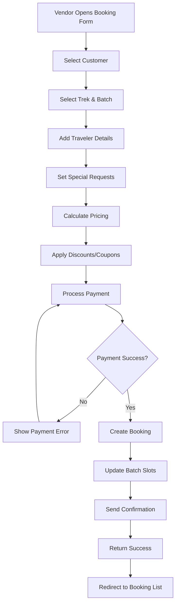
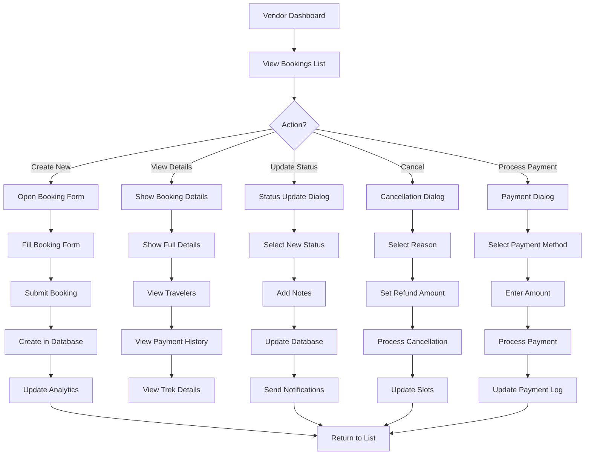
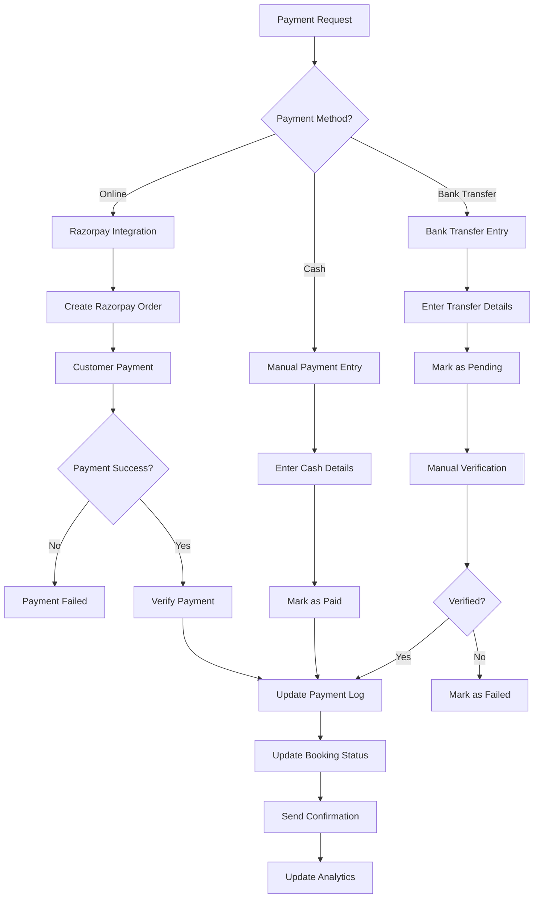
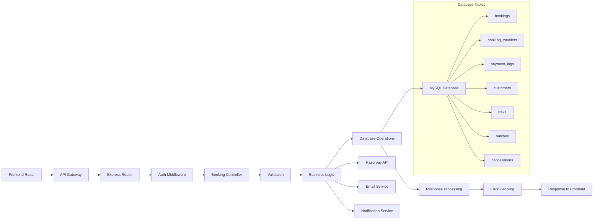

# Booking Management Module

## Overview

The Booking Management module handles all customer booking operations for vendors, including booking creation, status management, payment processing, and customer interactions. This module provides comprehensive booking lifecycle management from initial booking to completion.

## Module Components

### Frontend Components

- `Bookings.jsx` - Main booking management interface (2043 lines)
- `BookingForm.jsx` - Booking creation and editing form
- Booking details dialogs and status update components

### Backend Components

- `bookingController.js` - Main booking business logic (766 lines)
- `bookingRoutes.js` - API route definitions
- `Booking.js` - Database model (141 lines)
- `BookingTraveler.js` - Traveler details model

## Field Mapping

### Booking Information

| Frontend Field    | Backend API Field  | Database Column             | Type     | Required |
| ----------------- | ------------------ | --------------------------- | -------- | -------- |
| `bookingId`       | `id`               | `bookings.id`               | Integer  | Auto     |
| `customerId`      | `customer_id`      | `bookings.customer_id`      | Integer  | Yes      |
| `trekId`          | `trek_id`          | `bookings.trek_id`          | Integer  | Yes      |
| `batchId`         | `batch_id`         | `bookings.batch_id`         | Integer  | No       |
| `totalTravelers`  | `total_travelers`  | `bookings.total_travelers`  | Integer  | Yes      |
| `totalAmount`     | `total_amount`     | `bookings.total_amount`     | Decimal  | Yes      |
| `discountAmount`  | `discount_amount`  | `bookings.discount_amount`  | Decimal  | No       |
| `finalAmount`     | `final_amount`     | `bookings.final_amount`     | Decimal  | Yes      |
| `paymentStatus`   | `payment_status`   | `bookings.payment_status`   | ENUM     | Yes      |
| `bookingStatus`   | `status`           | `bookings.status`           | ENUM     | Yes      |
| `bookingDate`     | `booking_date`     | `bookings.booking_date`     | DateTime | Auto     |
| `specialRequests` | `special_requests` | `bookings.special_requests` | Text     | No       |
| `bookingSource`   | `booking_source`   | `bookings.booking_source`   | ENUM     | Yes      |
| `couponId`        | `coupon_id`        | `bookings.coupon_id`        | Integer  | No       |

### Traveler Information

| Frontend Field                    | Backend API Field                  | Database Column                          | Type    | Required |
| --------------------------------- | ---------------------------------- | ---------------------------------------- | ------- | -------- |
| `travelers[].name`                | `travelers[].name`                 | `booking_travelers.name`                 | String  | Yes      |
| `travelers[].email`               | `travelers[].email`                | `booking_travelers.email`                | String  | Yes      |
| `travelers[].phone`               | `travelers[].phone`                | `booking_travelers.phone`                | String  | Yes      |
| `travelers[].age`                 | `travelers[].age`                  | `booking_travelers.age`                  | Integer | No       |
| `travelers[].gender`              | `travelers[].gender`               | `booking_travelers.gender`               | ENUM    | No       |
| `travelers[].emergencyContact`    | `travelers[].emergency_contact`    | `booking_travelers.emergency_contact`    | String  | No       |
| `travelers[].dietaryRestrictions` | `travelers[].dietary_restrictions` | `booking_travelers.dietary_restrictions` | Text    | No       |
| `travelers[].medicalConditions`   | `travelers[].medical_conditions`   | `booking_travelers.medical_conditions`   | Text    | No       |
| `primaryContactTravelerId`        | `primary_contact_traveler_id`      | `bookings.primary_contact_traveler_id`   | Integer | No       |

### Payment Information

| Frontend Field  | Backend API Field | Database Column               | Type     | Required |
| --------------- | ----------------- | ----------------------------- | -------- | -------- |
| `paymentMethod` | `payment_method`  | `payment_logs.payment_method` | ENUM     | Yes      |
| `transactionId` | `transaction_id`  | `payment_logs.transaction_id` | String   | No       |
| `paymentAmount` | `amount`          | `payment_logs.amount`         | Decimal  | Yes      |
| `paymentStatus` | `status`          | `payment_logs.status`         | ENUM     | Yes      |
| `paymentDate`   | `payment_date`    | `payment_logs.payment_date`   | DateTime | Auto     |

### Search and Filter Fields

| Frontend Field   | Backend API Field        | Database Column         | Type    | Required |
| ---------------- | ------------------------ | ----------------------- | ------- | -------- |
| `searchTerm`     | `search`                 | N/A                     | String  | No       |
| `statusFilter`   | `status`                 | `bookings.status`       | ENUM    | No       |
| `dateRange`      | `start_date`, `end_date` | `bookings.booking_date` | Date    | No       |
| `trekFilter`     | `trek_id`                | `bookings.trek_id`      | Integer | No       |
| `customerFilter` | `customer_id`            | `bookings.customer_id`  | Integer | No       |

## API Endpoints

### Booking Management

#### 1. Get Vendor Bookings

- **URL**: `GET /api/vendor/bookings`
- **Method**: GET
- **Authentication**: Required (JWT)
- **Purpose**: Retrieve all bookings for the vendor
- **Query Parameters**:
  - `page`: Page number (default: 1)
  - `limit`: Items per page (default: 10)
  - `search`: Search term for booking ID, customer name, trek name
  - `status`: Filter by booking status
  - `start_date`: Filter from date
  - `end_date`: Filter to date
- **Response**:

```json
{
  "success": true,
  "data": {
    "bookings": [
      {
        "id": "integer",
        "booking_id": "string",
        "customer": {
          "id": "integer",
          "name": "string",
          "email": "string",
          "phone": "string"
        },
        "trek": {
          "id": "integer",
          "title": "string",
          "destination": "string"
        },
        "total_travelers": "integer",
        "total_amount": "decimal",
        "final_amount": "decimal",
        "status": "string",
        "payment_status": "string",
        "booking_date": "datetime",
        "batch": {
          "start_date": "date",
          "end_date": "date"
        }
      }
    ],
    "pagination": {
      "current_page": "integer",
      "total_pages": "integer",
      "total_items": "integer"
    },
    "analytics": {
      "total_bookings": "integer",
      "total_revenue": "decimal",
      "pending_bookings": "integer",
      "confirmed_bookings": "integer",
      "cancelled_bookings": "integer"
    }
  }
}
```

#### 2. Get Booking Details

- **URL**: `GET /api/vendor/bookings/:id`
- **Method**: GET
- **Authentication**: Required (JWT)
- **Purpose**: Get detailed booking information
- **Response**:

```json
{
  "success": true,
  "data": {
    "booking": {
      "id": "integer",
      "booking_id": "string",
      "customer": "object",
      "trek": "object",
      "batch": "object",
      "travelers": ["object"],
      "payment_logs": ["object"],
      "total_amount": "decimal",
      "final_amount": "decimal",
      "status": "string",
      "payment_status": "string",
      "special_requests": "string",
      "booking_date": "datetime"
    }
  }
}
```

#### 3. Create Booking

- **URL**: `POST /api/vendor/bookings`
- **Method**: POST
- **Authentication**: Required (JWT)
- **Purpose**: Create a new booking
- **Request Payload**:

```json
{
  "customer_id": "integer",
  "trek_id": "integer",
  "batch_id": "integer",
  "total_travelers": "integer",
  "total_amount": "decimal",
  "discount_amount": "decimal",
  "final_amount": "decimal",
  "special_requests": "string",
  "coupon_id": "integer",
  "travelers": [
    {
      "name": "string",
      "email": "string",
      "phone": "string",
      "age": "integer",
      "gender": "string",
      "emergency_contact": "string",
      "dietary_restrictions": "string",
      "medical_conditions": "string"
    }
  ],
  "payment": {
    "method": "string",
    "amount": "decimal",
    "transaction_id": "string"
  }
}
```

- **Response**:

```json
{
  "success": true,
  "message": "Booking created successfully",
  "data": {
    "booking_id": "string",
    "booking": "object"
  }
}
```

#### 4. Update Booking Status

- **URL**: `PUT /api/vendor/bookings/:id/status`
- **Method**: PUT
- **Authentication**: Required (JWT)
- **Purpose**: Update booking status
- **Request Payload**:

```json
{
  "status": "string",
  "notes": "string"
}
```

- **Response**:

```json
{
  "success": true,
  "message": "Booking status updated successfully"
}
```

#### 5. Cancel Booking

- **URL**: `POST /api/vendor/bookings/:id/cancel`
- **Method**: POST
- **Authentication**: Required (JWT)
- **Purpose**: Cancel a booking
- **Request Payload**:

```json
{
  "reason": "string",
  "refund_amount": "decimal"
}
```

- **Response**:

```json
{
  "success": true,
  "message": "Booking cancelled successfully",
  "data": {
    "cancellation": "object"
  }
}
```

### Payment Management

#### 6. Process Payment

- **URL**: `POST /api/vendor/bookings/:id/payment`
- **Method**: POST
- **Authentication**: Required (JWT)
- **Purpose**: Process payment for booking
- **Request Payload**:

```json
{
  "payment_method": "string",
  "amount": "decimal",
  "transaction_id": "string",
  "notes": "string"
}
```

#### 7. Get Payment History

- **URL**: `GET /api/vendor/bookings/:id/payments`
- **Method**: GET
- **Authentication**: Required (JWT)
- **Purpose**: Get payment history for booking
- **Response**:

```json
{
  "success": true,
  "data": {
    "payments": [
      {
        "id": "integer",
        "amount": "decimal",
        "method": "string",
        "status": "string",
        "transaction_id": "string",
        "payment_date": "datetime"
      }
    ]
  }
}
```

### Analytics

#### 8. Get Booking Analytics

- **URL**: `GET /api/vendor/bookings/analytics`
- **Method**: GET
- **Authentication**: Required (JWT)
- **Query Parameters**:
  - `start_date`: Start date for analytics
  - `end_date`: End date for analytics
  - `trek_id`: Filter by specific trek
- **Response**:

```json
{
  "success": true,
  "data": {
    "overview": {
      "total_bookings": "integer",
      "total_revenue": "decimal",
      "average_booking_value": "decimal",
      "conversion_rate": "decimal"
    },
    "status_distribution": {
      "pending": "integer",
      "confirmed": "integer",
      "cancelled": "integer",
      "completed": "integer"
    },
    "trends": {
      "daily_bookings": ["object"],
      "monthly_revenue": ["object"]
    },
    "top_treks": ["object"],
    "top_customers": ["object"]
  }
}
```

## Visual Flow Representation

### Booking Creation Flow



### Booking Management Flow



### Payment Processing Flow



### Data Flow Architecture



## Special Features

### Booking ID Generation

- Automatic generation of unique booking IDs (TBR format)
- Sequential numbering with vendor prefix
- Duplicate prevention

### Batch Slot Management

- Automatic slot allocation when booking is created
- Slot release when booking is cancelled
- Capacity validation before booking

### Payment Integration

- Razorpay payment gateway integration
- Multiple payment method support
- Payment verification and reconciliation

### Customer Management

- Existing customer selection
- New customer creation during booking
- Customer history and preferences

### Analytics Dashboard

- Real-time booking statistics
- Revenue tracking
- Performance metrics
- Trend analysis

## Error Handling

### Common Error Scenarios

1. **Validation Errors**: Invalid booking data
2. **Capacity Errors**: Batch is full
3. **Payment Errors**: Payment processing failures
4. **Customer Errors**: Invalid customer information
5. **System Errors**: Database or service failures

### Error Response Format

```json
{
  "success": false,
  "message": "Error description",
  "errors": {
    "field_name": ["Error message"]
  },
  "code": "ERROR_CODE"
}
```

## Performance Considerations

### Database Optimizations

- Indexed foreign keys for fast joins
- Pagination for large booking lists
- Efficient status filtering
- Optimized analytics queries

### Frontend Optimizations

- Lazy loading of booking details
- Debounced search functionality
- Efficient state management
- Optimized data fetching

## Security Measures

### Authentication

- JWT token validation for all booking operations
- Vendor-specific data isolation
- Session management

### Data Validation

- Input sanitization for all booking data
- SQL injection prevention
- XSS protection
- Payment data security

### Authorization

- Vendors can only access their own bookings
- Role-based access control
- API rate limiting
- Audit logging for sensitive operations
