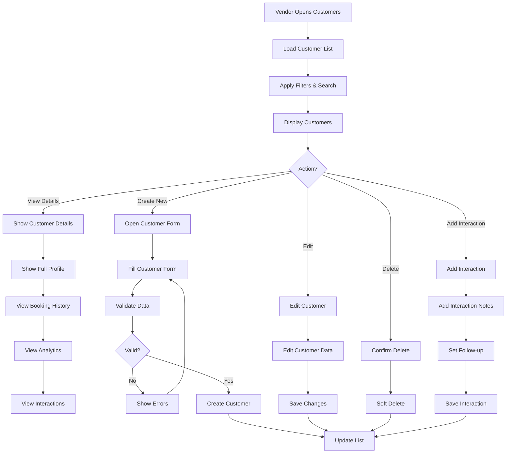
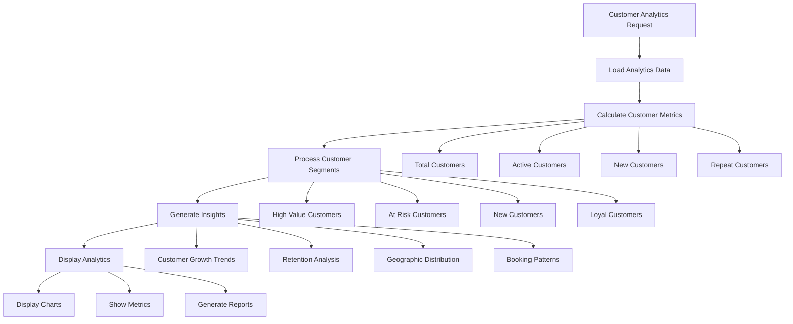
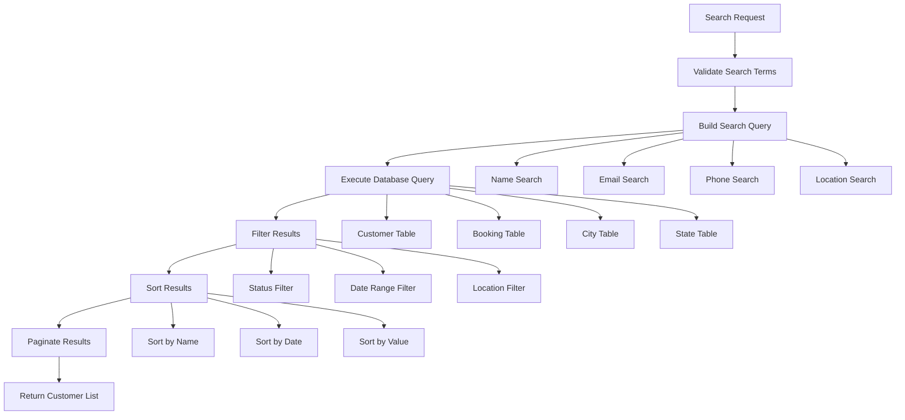
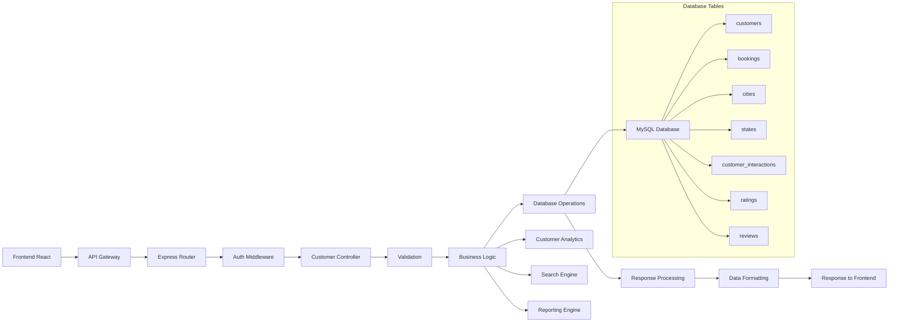

# Customer Management Module

## Overview

The Customer Management module allows vendors to manage customer relationships, track customer interactions, view booking history, and maintain customer profiles. This module provides comprehensive customer insights and relationship management capabilities.

## Module Components

### Frontend Components

- `Customers.jsx` - Main customer management interface (1006 lines)
- Customer details dialogs and forms
- Customer search and filtering components
- Customer analytics and insights

### Backend Components

- `customerController.js` - Customer business logic (509 lines)
- `customerRoutes.js` - Customer API routes
- `Customer.js` - Customer database model (100 lines)
- Customer analytics and reporting functions

## Field Mapping

### Customer Profile Fields

| Frontend Field     | Backend API Field   | Database Column               | Type     | Required |
| ------------------ | ------------------- | ----------------------------- | -------- | -------- |
| `customerId`       | `id`                | `customers.id`                | Integer  | Auto     |
| `name`             | `name`              | `customers.name`              | String   | Yes      |
| `email`            | `email`             | `customers.email`             | String   | Yes      |
| `phone`            | `phone`             | `customers.phone`             | String   | No       |
| `dateOfBirth`      | `date_of_birth`     | `customers.date_of_birth`     | Date     | No       |
| `gender`           | `gender`            | `customers.gender`            | ENUM     | No       |
| `address`          | `address`           | `customers.address`           | Text     | No       |
| `cityId`           | `city_id`           | `customers.city_id`           | Integer  | No       |
| `stateId`          | `state_id`          | `customers.state_id`          | Integer  | No       |
| `emergencyContact` | `emergency_contact` | `customers.emergency_contact` | String   | No       |
| `preferences`      | `preferences`       | `customers.preferences`       | JSON     | No       |
| `status`           | `status`            | `customers.status`            | ENUM     | Yes      |
| `createdAt`        | `created_at`        | `customers.created_at`        | DateTime | Auto     |

### Customer Analytics Fields

| Frontend Field        | Backend API Field       | Database Column         | Type     | Required |
| --------------------- | ----------------------- | ----------------------- | -------- | -------- |
| `totalBookings`       | `total_bookings`        | `bookings.id`           | Integer  | Auto     |
| `totalSpent`          | `total_spent`           | `bookings.total_amount` | Decimal  | Auto     |
| `averageBookingValue` | `average_booking_value` | Calculated              | Decimal  | Auto     |
| `lastBookingDate`     | `last_booking_date`     | `bookings.created_at`   | DateTime | Auto     |
| `favoriteTreks`       | `favorite_treks`        | Grouped by trek_id      | Array    | Auto     |
| `bookingFrequency`    | `booking_frequency`     | Calculated              | Decimal  | Auto     |
| `customerRating`      | `customer_rating`       | `ratings.rating_value`  | Decimal  | Auto     |
| `reviewCount`         | `review_count`          | `reviews.id`            | Integer  | Auto     |

### Customer Search Fields

| Frontend Field | Backend API Field        | Database Column                                        | Type    | Required |
| -------------- | ------------------------ | ------------------------------------------------------ | ------- | -------- |
| `searchTerm`   | `search`                 | `customers.name`, `customers.email`, `customers.phone` | String  | No       |
| `statusFilter` | `status`                 | `customers.status`                                     | ENUM    | No       |
| `cityFilter`   | `city_id`                | `customers.city_id`                                    | Integer | No       |
| `stateFilter`  | `state_id`               | `customers.state_id`                                   | Integer | No       |
| `dateRange`    | `start_date`, `end_date` | `customers.created_at`                                 | Date    | No       |

### Customer Interaction Fields

| Frontend Field     | Backend API Field    | Database Column                            | Type     | Required |
| ------------------ | -------------------- | ------------------------------------------ | -------- | -------- |
| `interactionType`  | `interaction_type`   | `customer_interactions.type`               | ENUM     | Yes      |
| `interactionNotes` | `notes`              | `customer_interactions.notes`              | Text     | No       |
| `interactionDate`  | `interaction_date`   | `customer_interactions.created_at`         | DateTime | Auto     |
| `followUpRequired` | `follow_up_required` | `customer_interactions.follow_up_required` | Boolean  | No       |
| `followUpDate`     | `follow_up_date`     | `customer_interactions.follow_up_date`     | Date     | No       |

## API Endpoints

### Customer Management

#### 1. Get Vendor Customers

- **URL**: `GET /api/vendor/customers`
- **Method**: GET
- **Authentication**: Required (JWT)
- **Purpose**: Get all customers for the vendor
- **Query Parameters**:
  - `page`: Page number (default: 1)
  - `limit`: Items per page (default: 10)
  - `search`: Search term for name, email, phone
  - `status`: Filter by customer status
  - `city_id`: Filter by city
  - `state_id`: Filter by state
- **Response**:

```json
{
  "success": true,
  "data": {
    "customers": [
      {
        "id": "integer",
        "name": "string",
        "email": "string",
        "phone": "string",
        "city": {
          "id": "integer",
          "cityName": "string"
        },
        "state": {
          "id": "integer",
          "name": "string"
        },
        "total_bookings": "integer",
        "total_spent": "decimal",
        "last_booking_date": "datetime",
        "status": "string",
        "created_at": "datetime"
      }
    ],
    "pagination": {
      "current_page": "integer",
      "total_pages": "integer",
      "total_items": "integer"
    },
    "analytics": {
      "total_customers": "integer",
      "active_customers": "integer",
      "new_customers_this_month": "integer",
      "average_customer_value": "decimal"
    }
  }
}
```

#### 2. Get Customer Details

- **URL**: `GET /api/vendor/customers/:id`
- **Method**: GET
- **Authentication**: Required (JWT)
- **Purpose**: Get detailed customer information
- **Response**:

```json
{
  "success": true,
  "data": {
    "customer": {
      "id": "integer",
      "name": "string",
      "email": "string",
      "phone": "string",
      "date_of_birth": "date",
      "gender": "string",
      "address": "string",
      "city": "object",
      "state": "object",
      "emergency_contact": "string",
      "preferences": "object",
      "status": "string",
      "created_at": "datetime"
    },
    "bookings": [
      {
        "id": "integer",
        "booking_id": "string",
        "trek": "object",
        "total_amount": "decimal",
        "status": "string",
        "booking_date": "datetime"
      }
    ],
    "analytics": {
      "total_bookings": "integer",
      "total_spent": "decimal",
      "average_booking_value": "decimal",
      "favorite_treks": ["object"],
      "booking_frequency": "decimal",
      "customer_rating": "decimal",
      "review_count": "integer"
    }
  }
}
```

#### 3. Create Customer

- **URL**: `POST /api/vendor/customers`
- **Method**: POST
- **Authentication**: Required (JWT)
- **Purpose**: Create a new customer
- **Request Payload**:

```json
{
  "name": "string",
  "email": "string",
  "phone": "string",
  "date_of_birth": "date",
  "gender": "string",
  "address": "string",
  "city_id": "integer",
  "state_id": "integer",
  "emergency_contact": "string",
  "preferences": "object"
}
```

- **Response**:

```json
{
  "success": true,
  "message": "Customer created successfully",
  "data": {
    "customer": "object"
  }
}
```

#### 4. Update Customer

- **URL**: `PUT /api/vendor/customers/:id`
- **Method**: PUT
- **Authentication**: Required (JWT)
- **Purpose**: Update customer information
- **Request Payload**: Same as Create Customer
- **Response**:

```json
{
  "success": true,
  "message": "Customer updated successfully",
  "data": {
    "customer": "object"
  }
}
```

#### 5. Delete Customer

- **URL**: `DELETE /api/vendor/customers/:id`
- **Method**: DELETE
- **Authentication**: Required (JWT)
- **Purpose**: Soft delete customer
- **Response**:

```json
{
  "success": true,
  "message": "Customer deleted successfully"
}
```

### Customer Analytics

#### 6. Get Customer Analytics

- **URL**: `GET /api/vendor/customers/analytics`
- **Method**: GET
- **Authentication**: Required (JWT)
- **Purpose**: Get customer analytics and insights
- **Query Parameters**:
  - `period`: Time period for analysis
  - `start_date`: Start date for custom range
  - `end_date`: End date for custom range
- **Response**:

```json
{
  "success": true,
  "data": {
    "overview": {
      "total_customers": "integer",
      "active_customers": "integer",
      "new_customers": "integer",
      "repeat_customers": "integer",
      "average_customer_value": "decimal"
    },
    "trends": {
      "customer_growth": "decimal",
      "retention_rate": "decimal",
      "average_booking_frequency": "decimal"
    },
    "top_customers": [
      {
        "customer_id": "integer",
        "name": "string",
        "total_bookings": "integer",
        "total_spent": "decimal",
        "last_booking": "datetime"
      }
    ],
    "customer_segments": [
      {
        "segment": "string",
        "count": "integer",
        "percentage": "decimal"
      }
    ],
    "geographic_distribution": [
      {
        "city": "string",
        "state": "string",
        "customer_count": "integer"
      }
    ]
  }
}
```

#### 7. Get Customer Interactions

- **URL**: `GET /api/vendor/customers/:id/interactions`
- **Method**: GET
- **Authentication**: Required (JWT)
- **Purpose**: Get customer interaction history
- **Response**:

```json
{
  "success": true,
  "data": {
    "interactions": [
      {
        "id": "integer",
        "type": "string",
        "notes": "string",
        "follow_up_required": "boolean",
        "follow_up_date": "date",
        "created_at": "datetime"
      }
    ]
  }
}
```

#### 8. Add Customer Interaction

- **URL**: `POST /api/vendor/customers/:id/interactions`
- **Method**: POST
- **Authentication**: Required (JWT)
- **Purpose**: Add customer interaction
- **Request Payload**:

```json
{
  "type": "string",
  "notes": "string",
  "follow_up_required": "boolean",
  "follow_up_date": "date"
}
```

- **Response**:

```json
{
  "success": true,
  "message": "Interaction added successfully",
  "data": {
    "interaction": "object"
  }
}
```

## Visual Flow Representation

### Customer Management Flow



### Customer Analytics Flow



### Customer Search Flow



### Data Flow Architecture



## Special Features

### Customer Segmentation

- High-value customers identification
- At-risk customer detection
- New customer tracking
- Loyal customer recognition

### Customer Insights

- Booking pattern analysis
- Preference tracking
- Satisfaction metrics
- Geographic distribution

### Interaction Management

- Customer interaction logging
- Follow-up scheduling
- Communication history
- Relationship tracking

### Advanced Search

- Multi-field search
- Filter combinations
- Geographic search
- Date range filtering

## Error Handling

### Common Error Scenarios

1. **Validation Errors**: Invalid customer data
2. **Duplicate Errors**: Email already exists
3. **Permission Errors**: Unauthorized access
4. **Database Errors**: Customer not found
5. **Search Errors**: Invalid search parameters

### Error Response Format

```json
{
  "success": false,
  "message": "Error description",
  "errors": {
    "field_name": ["Error message"]
  },
  "code": "ERROR_CODE"
}
```

## Performance Considerations

### Database Optimizations

- Indexed search fields
- Efficient customer queries
- Optimized analytics queries
- Pagination for large datasets

### Frontend Optimizations

- Lazy loading of customer details
- Debounced search functionality
- Efficient state management
- Optimized data fetching

## Security Measures

### Data Protection

- Customer data privacy
- Secure data transmission
- Access control validation
- Audit logging

### Authorization

- Vendor-specific customer access
- Role-based permissions
- API rate limiting
- Data isolation
