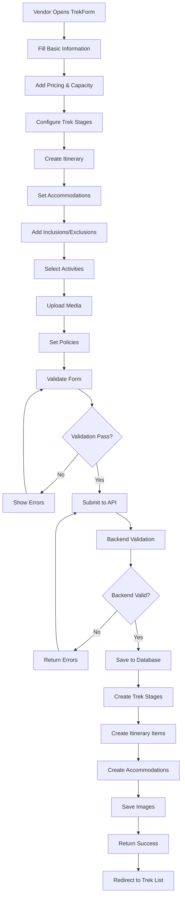
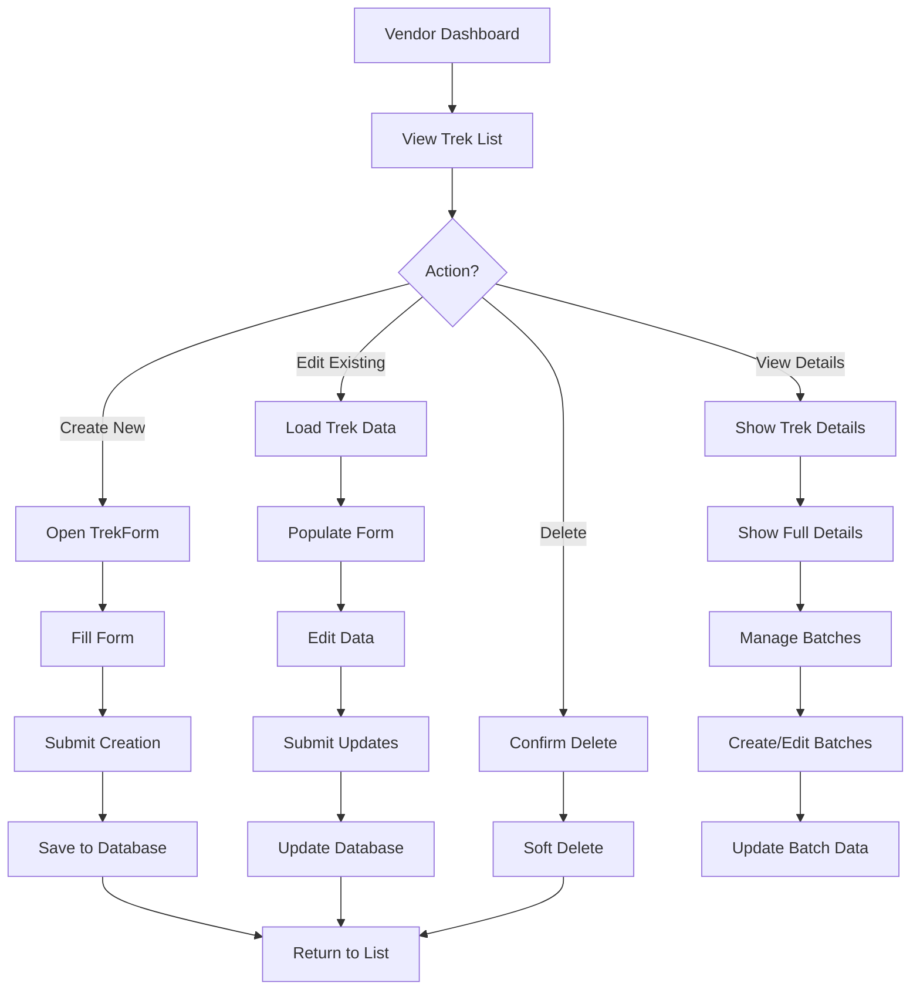
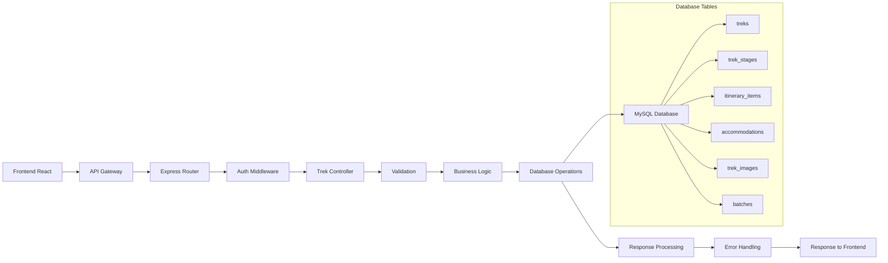

# Trek Management Module

## Overview

The Trek Management module is the core functionality of the vendor panel, allowing vendors to create, edit, and manage comprehensive trek listings. This module handles all aspects of trek creation including basic information, pricing, scheduling, itineraries, logistics, and media.

## Module Components

### Frontend Components

- `TrekForm.jsx` - Main trek creation/editing form (7931 lines)
- `Treks.jsx` - Trek listing and management interface
- `EditTrek.jsx` - Quick trek editing interface
- `CreateTrek.jsx` - Trek creation entry point

### Backend Components

- `trekController.js` - Main trek business logic (1647 lines)
- `trekRoutes.js` - API route definitions (491 lines)
- `Trek.js` - Database model (312 lines)

## Field Mapping

### Basic Information Section

| Frontend Field      | Backend API Field   | Database Column           | Type       | Required |
| ------------------- | ------------------- | ------------------------- | ---------- | -------- |
| `title`             | `title`             | `treks.title`             | String     | Yes      |
| `description`       | `description`       | `treks.description`       | Text       | No       |
| `short_description` | `short_description` | `treks.short_description` | Text       | No       |
| `destination`       | `destination_id`    | `treks.destination_id`    | Integer    | Yes      |
| `city_ids[]`        | `city_ids`          | `treks.city_ids`          | JSON Array | No       |
| `duration`          | `duration`          | `treks.duration`          | String     | No       |
| `duration_days`     | `duration_days`     | `treks.duration_days`     | Integer    | Yes      |
| `duration_nights`   | `duration_nights`   | `treks.duration_nights`   | Integer    | Yes      |
| `difficulty`        | `difficulty`        | `treks.difficulty`        | ENUM       | Yes      |
| `trek_type`         | `trek_type`         | `treks.trek_type`         | ENUM       | Yes      |
| `category`          | `category`          | `treks.category`          | String     | No       |

### Pricing & Capacity Section

| Frontend Field     | Backend API Field  | Database Column          | Type    | Required |
| ------------------ | ------------------ | ------------------------ | ------- | -------- |
| `base_price`       | `base_price`       | `treks.base_price`       | Decimal | Yes      |
| `max_participants` | `max_participants` | `treks.max_participants` | Integer | Yes      |
| `has_discount`     | `has_discount`     | `treks.has_discount`     | Boolean | No       |
| `discount_type`    | `discount_type`    | `treks.discount_type`    | ENUM    | No       |
| `discount_value`   | `discount_value`   | `treks.discount_value`   | Decimal | No       |

### Trek Stages Section

| Frontend Field             | Backend API Field      | Database Column           | Type   | Required |
| -------------------------- | ---------------------- | ------------------------- | ------ | -------- |
| `trekStages[].type`        | `stages[].type`        | `trek_stages.type`        | ENUM   | Yes      |
| `trekStages[].time`        | `stages[].time`        | `trek_stages.time`        | String | Yes      |
| `trekStages[].ampm`        | `stages[].ampm`        | `trek_stages.ampm`        | String | Yes      |
| `trekStages[].destination` | `stages[].destination` | `trek_stages.destination` | String | Yes      |
| `trekStages[].transport`   | `stages[].transport`   | `trek_stages.transport`   | String | No       |

### Itinerary Section

| Frontend Field                 | Backend API Field        | Database Column              | Type       | Required |
| ------------------------------ | ------------------------ | ---------------------------- | ---------- | -------- |
| `itineraryDays[].day`          | `itinerary[].day`        | `itinerary_items.day`        | Integer    | Yes      |
| `itineraryDays[].activities[]` | `itinerary[].activities` | `itinerary_items.activities` | JSON Array | No       |

### Accommodation Section

| Frontend Field              | Backend API Field           | Database Column           | Type    | Required |
| --------------------------- | --------------------------- | ------------------------- | ------- | -------- |
| `accommodations[].night`    | `accommodations[].night`    | `accommodations.night`    | Integer | Yes      |
| `accommodations[].location` | `accommodations[].location` | `accommodations.location` | String  | Yes      |
| `accommodations[].type`     | `accommodations[].type`     | `accommodations.type`     | String  | Yes      |

### Inclusions & Exclusions

| Frontend Field         | Backend API Field   | Database Column           | Type       | Required |
| ---------------------- | ------------------- | ------------------------- | ---------- | -------- |
| `selectedInclusions[]` | `inclusion_ids`     | `treks.inclusion_ids`     | JSON Array | No       |
| `customInclusions[]`   | `custom_inclusions` | `treks.custom_inclusions` | JSON Array | No       |
| `selectedExclusions[]` | `exclusion_ids`     | `treks.exclusion_ids`     | JSON Array | No       |
| `customExclusions[]`   | `custom_exclusions` | `treks.custom_exclusions` | JSON Array | No       |

### Activities Section

| Frontend Field         | Backend API Field   | Database Column           | Type       | Required |
| ---------------------- | ------------------- | ------------------------- | ---------- | -------- |
| `selectedActivities[]` | `activity_ids`      | `treks.activity_ids`      | JSON Array | No       |
| `customActivities[]`   | `custom_activities` | `treks.custom_activities` | JSON Array | No       |

### Media Section

| Frontend Field   | Backend API Field | Database Column         | Type         | Required |
| ---------------- | ----------------- | ----------------------- | ------------ | -------- |
| `media[]`        | `images`          | `trek_images.image_url` | String Array | No       |
| `featured_image` | `featured_image`  | `treks.featured_image`  | String       | No       |

### Policies Section

| Frontend Field           | Backend API Field        | Database Column                | Type       | Required |
| ------------------------ | ------------------------ | ------------------------------ | ---------- | -------- |
| `cancellation_policy_id` | `cancellation_policy_id` | `treks.cancellation_policy_id` | Integer    | No       |
| `other_policies[]`       | `other_policies`         | `treks.other_policies`         | JSON Array | No       |
| `trekking_rules`         | `trekking_rules`         | `treks.trekking_rules`         | Text       | No       |
| `emergency_protocols`    | `emergency_protocols`    | `treks.emergency_protocols`    | Text       | No       |
| `organizer_notes`        | `organizer_notes`        | `treks.organizer_notes`        | Text       | No       |

## API Endpoints

### Trek Creation & Management

#### 1. Create Trek

- **URL**: `POST /api/vendor/treks`
- **Method**: POST
- **Authentication**: Required (JWT)
- **Purpose**: Create a new trek listing
- **Request Payload**:

```json
{
  "title": "string",
  "description": "string",
  "destination_id": "integer",
  "city_ids": ["integer"],
  "duration_days": "integer",
  "duration_nights": "integer",
  "base_price": "decimal",
  "max_participants": "integer",
  "difficulty": "enum",
  "trek_type": "enum",
  "stages": [
    {
      "type": "string",
      "time": "string",
      "ampm": "string",
      "destination": "string",
      "transport": "string"
    }
  ],
  "itinerary": [
    {
      "day": "integer",
      "activities": ["string"]
    }
  ],
  "accommodations": [
    {
      "night": "integer",
      "location": "string",
      "type": "string"
    }
  ],
  "inclusion_ids": ["integer"],
  "exclusion_ids": ["integer"],
  "activity_ids": ["integer"],
  "images": ["base64_string"],
  "featured_image": "base64_string"
}
```

- **Response**:

```json
{
  "success": true,
  "message": "Trek created successfully",
  "data": {
    "trek_id": "integer",
    "title": "string"
  }
}
```

#### 2. Get Trek Details

- **URL**: `GET /api/vendor/treks/:id`
- **Method**: GET
- **Authentication**: Required (JWT)
- **Purpose**: Retrieve detailed trek information
- **Response**:

```json
{
  "success": true,
  "data": {
    "id": "integer",
    "title": "string",
    "description": "string",
    "base_price": "decimal",
    "max_participants": "integer",
    "difficulty": "string",
    "trek_type": "string",
    "stages": ["object"],
    "itinerary": ["object"],
    "accommodations": ["object"],
    "inclusions": ["object"],
    "exclusions": ["object"],
    "activities": ["object"],
    "images": ["string"],
    "featured_image": "string",
    "rating": "decimal",
    "review_count": "integer"
  }
}
```

#### 3. Update Trek

- **URL**: `PUT /api/vendor/treks/:id`
- **Method**: PUT
- **Authentication**: Required (JWT)
- **Purpose**: Update existing trek information
- **Request Payload**: Same as Create Trek
- **Response**:

```json
{
  "success": true,
  "message": "Trek updated successfully",
  "data": {
    "trek_id": "integer"
  }
}
```

#### 4. Delete Trek

- **URL**: `DELETE /api/vendor/treks/:id`
- **Method**: DELETE
- **Authentication**: Required (JWT)
- **Purpose**: Soft delete trek (mark as inactive)
- **Response**:

```json
{
  "success": true,
  "message": "Trek deleted successfully"
}
```

#### 5. List Treks

- **URL**: `GET /api/vendor/treks`
- **Method**: GET
- **Authentication**: Required (JWT)
- **Query Parameters**:
  - `page`: Page number (default: 1)
  - `limit`: Items per page (default: 10)
  - `status`: Filter by status (active/inactive)
  - `search`: Search by title
- **Response**:

```json
{
  "success": true,
  "data": {
    "treks": ["object"],
    "pagination": {
      "current_page": "integer",
      "total_pages": "integer",
      "total_items": "integer",
      "items_per_page": "integer"
    }
  }
}
```

### Batch Management

#### 6. Create Batch

- **URL**: `POST /api/vendor/treks/:trekId/batches`
- **Method**: POST
- **Authentication**: Required (JWT)
- **Purpose**: Create trek batches for specific dates
- **Request Payload**:

```json
{
  "start_date": "date",
  "end_date": "date",
  "max_participants": "integer",
  "price": "decimal",
  "status": "string"
}
```

#### 7. Get Trek Batches

- **URL**: `GET /api/vendor/treks/:trekId/batches`
- **Method**: GET
- **Authentication**: Required (JWT)
- **Purpose**: Get all batches for a trek
- **Response**:

```json
{
  "success": true,
  "data": {
    "batches": [
      {
        "id": "integer",
        "start_date": "date",
        "end_date": "date",
        "max_participants": "integer",
        "booked_participants": "integer",
        "price": "decimal",
        "status": "string"
      }
    ]
  }
}
```

## Visual Flow Representation

### Trek Creation Flow



### Trek Management Flow



### Data Flow Architecture



## Special Features

### Form Progress Tracking

The TrekForm component includes comprehensive progress tracking across all sections:

- Basic Information (20%)
- Classification (15%)
- Dates & Pricing (15%)
- Stages (15%)
- Itinerary (10%)
- Logistics (10%)
- Inclusions (5%)
- Activities (5%)
- Media (3%)
- Policies (2%)

### Auto-Generated Dates

The system can automatically generate trek dates based on:

- Selected service days (e.g., weekends)
- Trek duration
- Year range selection

### Image Management

- Base64 image upload and storage
- Featured image selection
- Multiple image support
- Image validation and optimization

### Validation System

Comprehensive validation at multiple levels:

- Frontend form validation
- Backend API validation
- Database constraint validation
- Business rule validation

## Error Handling

### Common Error Scenarios

1. **Validation Errors**: Field-specific error messages
2. **Authentication Errors**: JWT token validation
3. **Database Errors**: Constraint violations
4. **File Upload Errors**: Image processing issues
5. **Business Logic Errors**: Invalid state transitions

### Error Response Format

```json
{
  "success": false,
  "message": "Error description",
  "errors": {
    "field_name": ["Error message"]
  },
  "code": "ERROR_CODE"
}
```

## Performance Considerations

### Database Optimizations

- Indexed foreign keys
- Efficient JSON field queries
- Pagination for large datasets
- Soft deletes for data integrity

### Frontend Optimizations

- Lazy loading of form sections
- Debounced search inputs
- Optimized image handling
- Efficient state management

## Security Measures

### Authentication

- JWT token validation on all protected routes
- Vendor-specific data isolation
- Session management

### Data Validation

- Input sanitization
- SQL injection prevention
- XSS protection
- File upload security

### Authorization

- Vendor can only access their own treks
- Role-based access control
- API rate limiting
